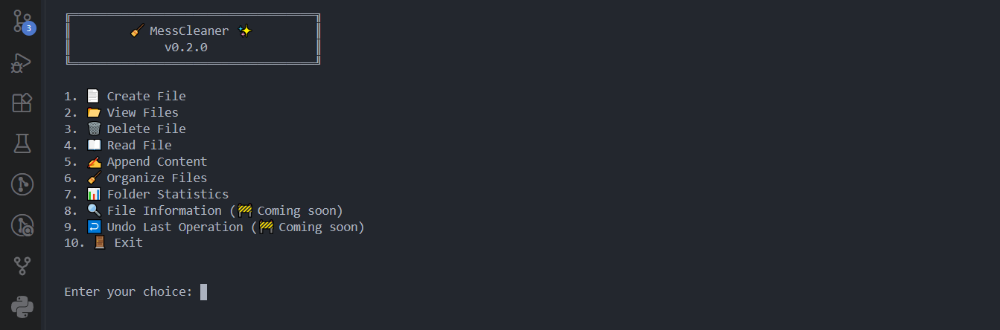

# 🧹 MessCleaner

> **A Python-based command-line file manager evolving into an intelligent AI-powered file management system.**


---

# 📖 About

MessCleaner is an open-source Python project that started as a simple command-line file manager and is designed to evolve into an intelligent AI-powered file management system.

The current version provides essential file management operations, automatic file organization, and basic folder statistics while building a foundation for future intelligent features such as duplicate detection, semantic search, automation, natural language commands, and AI-assisted file management.

This project is part of my learning journey in Python, software engineering, and Artificial Intelligence.

---

## 📸 Preview



---

# ✨ Current Features

### 📄 File Management

* 📄 Create new files
* 📂 View files and folders
* 📖 Read file contents
* ✍️ Append text to files
* 🗑️ Delete files
* ⚠️ Error handling for invalid operations

### 🧹 File Organization

* 📁 Automatically organize files into category-based folders
* 🔍 Detect file categories using file extensions
* 📦 Supports multiple file types and categories
* 🔄 Handles duplicate filenames automatically
* 👀 Shows a preview before moving files
* ❌ Allows the user to cancel the operation

### 📊 Folder Statistics

* 📄 Count files in a folder
* 📁 Count direct subfolders
* 💾 Calculate total file size
* 🗂️ Display file count by category
* 💽 Display storage used by each category
* ❓ Automatically classify unknown file types as `Others`

> **Note:** Folder Statistics currently scans only the direct contents of the selected folder. Recursive folder analysis is planned for a future version.

### 💻 Command-Line Interface

* 🔢 Interactive menu-based interface
* 🖥️ Terminal-based workflow
* 🛡️ Basic validation and error handling

---

# 🚀 Future Roadmap

MessCleaner is actively being developed. Planned features include:

* 📊 Advanced Folder Analyzer
* 🔄 Recursive folder scanning
* 📈 Storage visualization and charts
* 📦 Batch file operations
* 🔍 Duplicate file detection
* 🧠 Smart file insights
* 🕒 File age and activity analysis
* 📏 Large file analysis
* 🗑️ Cleanup candidate detection
* ↩️ Undo support
* 👀 Folder monitoring
* 🔎 Smart file search
* 🧠 Semantic search using AI
* 🤖 AI-powered file classification
* 💬 Natural language commands
* 🎙️ Voice commands
* 🖥️ Modern GUI
* 🔒 File encryption
* ☁️ Cloud synchronization
* 🔌 Plugin support
* 🧠 Local AI model integration

---

# 🛠️ Technologies Used

| Technology | Purpose                                 |
| ---------- | --------------------------------------- |
| Python     | Core programming language               |
| `os`       | File and directory operations           |
| `shutil`   | File organization and moving operations |

MessCleaner currently uses only Python's **standard library**, so no external Python packages are required.

---

# 📂 Project Structure

```text
MessCleaner/
│
├── main.py
├── README.md
├── LICENSE
├── .gitignore
├── requirements.txt
└── screenshots/
    └── terminal-demo.png
```

---

# ⚙️ Installation

### 1. Clone the repository

```bash
git clone https://github.com/pratham-MATRIX/Mess-Cleaner-AI.git
```

### 2. Navigate into the project

```bash
cd Mess-Cleaner-AI
```

### 3. Run MessCleaner

```bash
python main.py
```

> Python 3.x is required.

---

# 💻 Usage

After running MessCleaner, the main menu provides the following options:

```text
1. 📄 Create File
2. 📂 View Files
3. 🗑️  Delete File
4. 📖 Read File
5. ✍️  Append Content
6. 🧹 Organize Files
7. 📊 Folder Statistics
8. 🔍 File Information (Coming soon)
9. ↩️  Undo Last Operation (Coming soon)
10. 🚪 Exit
```

### 🧹 Organize Files

Select option `6` and provide the folder path.

MessCleaner will:

1. Scan the folder
2. Identify file types
3. Assign files to categories
4. Show the planned changes
5. Ask for confirmation
6. Organize the files automatically

### 📊 Folder Statistics

Select option `7` and provide a folder path.

MessCleaner will display:

* Total number of files
* Total number of subfolders
* Total storage used
* File count by category
* Storage used by each category

---

# 📌 Project Status

**Current Version**

`v0.2.0`

**Development Status**

🟢 Active Development

MessCleaner is currently focused on building a reliable command-line foundation before introducing advanced analysis and AI functionality.

---

# 🗺️ Development Progress

| Feature                    | Status      |
| -------------------------- | ----------- |
| Basic File Manager         | ✅ Completed |
| File Organization          | ✅ Completed |
| Folder Statistics          | ✅ Completed |
| Category-wise Statistics   | ✅ Completed |
| Recursive Folder Analysis  | ⏳ Planned   |
| Advanced Folder Analyzer   | ⏳ Planned   |
| Batch Operations           | ⏳ Planned   |
| Duplicate Detection        | ⏳ Planned   |
| Smart File Insights        | ⏳ Planned   |
| GUI Version                | ⏳ Planned   |
| AI File Classification     | ⏳ Planned   |
| Semantic Search            | ⏳ Planned   |
| Voice Commands             | ⏳ Planned   |
| Natural Language Interface | ⏳ Planned   |
| Local AI Assistant         | ⏳ Planned   |

---

# 🤝 Contributing

Contributions, ideas, suggestions, and feature requests are always welcome.

If you'd like to improve MessCleaner, feel free to fork the repository and submit a pull request.

---

# 📜 License

This project is licensed under the **MIT License**.

See the `LICENSE` file for more information.

---

# 👨‍💻 Author

**Pratham Singh Thakur**

Python Developer • AI/ML Student • Open Source Learner

---

# ⭐ Support

If you find MessCleaner useful or interesting, consider giving the project a **⭐ Star** on GitHub.

It motivates continued development and future improvements.

---

## 🚧 Version History

### v0.2.0 — Organization & Statistics

* Added automatic file organization
* Added category-based file classification
* Added duplicate filename handling during organization
* Added organization preview and confirmation
* Added folder statistics
* Added file and subfolder counting
* Added total folder storage calculation
* Added category-wise file statistics
* Added category-wise storage statistics
* Improved CLI menu

### v0.1.0 — Initial Release

* Initial command-line file manager
* File creation
* File deletion
* Read file contents
* Append content to files
* View files and directories
* Basic error handling
* Foundation for future intelligent file management features

---

> **"Every great software project starts with a simple first version."**
