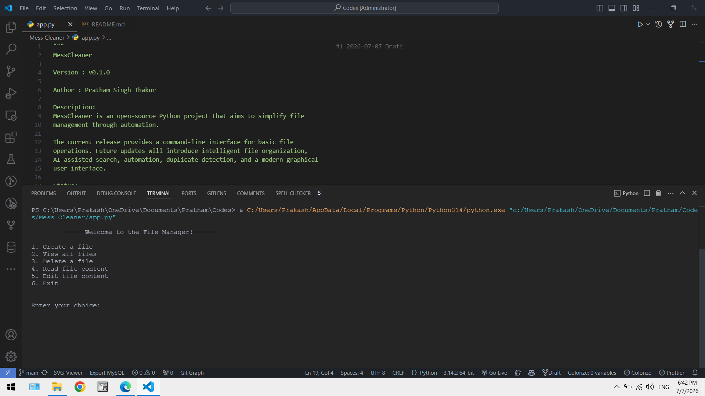

# 🧹 MessCleaner

> **A Python-based command-line file manager that is evolving into an AI-powered file management system.**


---

# 📖 About

MessCleaner is an open-source Python project that began as a simple command-line file manager and is designed to evolve into an intelligent AI-powered file management system.

The current version focuses on implementing the core file management operations while building a solid foundation for future AI features such as intelligent file organization, semantic search, automation, duplicate detection, natural language commands, and much more.

This project is part of my learning journey in Python, software engineering, and Artificial Intelligence.

---

## 📸 Preview



---

# ✨ Current Features

* 📄 Create new files
* 📂 View all files and folders
* 📖 Read file contents
* ✍️ Append text to existing files
* 🗑️ Delete files
* ⚠️ Error handling for invalid operations
* 💻 Interactive command-line interface

---

# 🚀 Future Roadmap

MessCleaner is actively being developed. Planned features include:

* 📁 Automatic File Organization
* 🤖 AI-powered File Classification
* 🔍 Smart File Search
* 🧠 Semantic Search using AI
* 🗂️ Duplicate File Detection
* 📊 File Statistics Dashboard
* 📦 Batch File Operations
* 🔄 Undo Support
* 👀 Folder Monitoring
* 🖥️ Modern GUI (CustomTkinter)
* 🎙️ Voice Commands
* 💬 Natural Language Commands
* 🔒 File Encryption
* ☁️ Cloud Synchronization
* 🔌 Plugin Support
* 🧠 Local AI Model Integration

---

# 🛠️ Technologies Used

| Technology | Purpose                           |
| ---------- | --------------------------------- |
| Python     | Core Programming Language         |
| os         | File & Directory Operations       |
| time       | Terminal Delays & User Experience |

---

# 📂 Project Structure

```text
MessCleaner/
│
├── app.py
├── README.md
├── LICENSE
├── .gitignore
├── requirements.txt
└── screenshots/
    └── terminal-demo.png
```

---

# ⚙️ Installation

Clone the repository:

```bash
git clone https://github.com/pratham-MATRIX/Mess-Cleaner-AI.git
```

Navigate into the project:

```bash
cd MessCleaner
```

Run the application:

```bash
python main.py
```

---

# 💻 Usage

After running the program you'll see:

```text
1. Create a File
2. View all Files
3. Delete a File
4. Read File Content
5. Append Content
6. Exit
```

Choose an option by entering its corresponding number.

---

# 📌 Project Status

**Current Version**

`v0.1.0`

**Development Status**

🟢 Active Development

MessCleaner is continuously improving and new features will be released in future updates.

---

# 🗺️ Development Progress

| Feature                    | Status      |
| -------------------------- | ----------- |
| Basic File Manager         | ✅ Completed |
| File Organization          | ⏳ Planned   |
| Batch Operations           | ⏳ Planned   |
| Duplicate Detection        | ⏳ Planned   |
| GUI Version                | ⏳ Planned   |
| AI File Classification     | ⏳ Planned   |
| Semantic Search            | ⏳ Planned   |
| Voice Commands             | ⏳ Planned   |
| Natural Language Interface | ⏳ Planned   |
| Local AI Assistant         | ⏳ Planned   |

---

# 🤝 Contributing

Contributions, ideas, suggestions, and feature requests are always welcome.

If you'd like to improve MessCleaner, feel free to fork the repository and submit a pull request.

---

# 📜 License

This project is licensed under the **MIT License**.

See the `LICENSE` file for more information.

---

# 👨‍💻 Author

**Pratham Singh Thakur**

Python Developer • AI/ML Student • Open Source Learner

---

# ⭐ Support

If you found this project helpful or interesting, consider giving it a **⭐ Star** on GitHub.

It motivates me to continue improving MessCleaner and adding exciting new features.

---

## 🚧 Version History

### v0.1.0 — Initial Release

* Initial command-line file manager
* File creation
* File deletion
* Read file contents
* Append content to files
* View files and directories
* Error handling
* Foundation for future AI-powered features

---

> **"Every great software project starts with a simple first version."**
